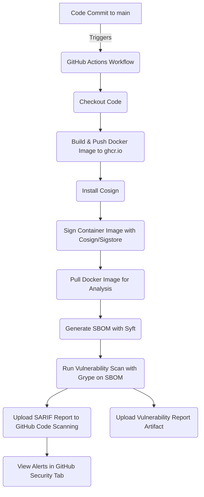
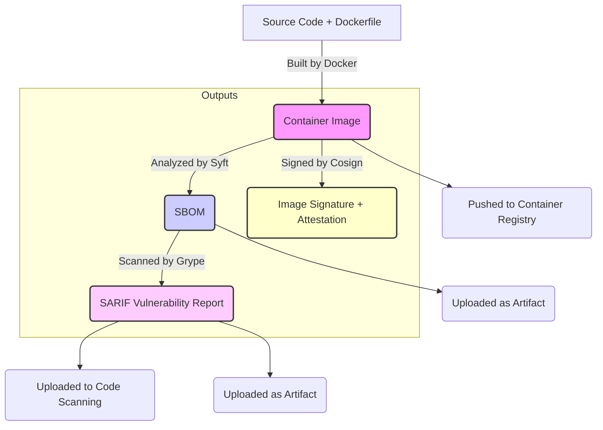

# **Software Supply Chain Security Lab**

This repository contains a hands-on lab project designed to build and demonstrate practical experience in key areas of modern **software supply chain security**. By automating a workflow that includes **container image building**, **SBOM generation**, **digital signing**, and **vulnerability scanning**, this project showcases core technical competencies relevant to Solutions/Sales Engineering roles focused on **securing the software development lifecycle**.  

The project utilizes popular **open-source tools** (Syft, Grype, Cosign) and integrates with **GitHub Actions** for automation, providing a tangible example of implementing security best practices in a **CI/CD**-like pipeline.

> TLDR - Key Lessons I Learned:
>
> * The process of securing container images is not trivial.. it takes effort, knowledge, and attention to detail.
> * My simple Python app running on an Ubuntu runner has 220 vulnerabilities.
> * There is a lot of uncertainty as to which CVEs are worth fixing and which aren't.
> * <b>TAKEAWAY:</b> There is huge value in starting with a secure foundation.

---

## **Concepts Demonstrated**

* **Container Image Building:** Creating a reproducible application environment using Docker.  
* **Software Bill of Materials (SBOM) Generation:** Creating a comprehensive inventory of software components within a container image using Syft.  
* **Digital Signing & Provenance:** Verifying the origin and integrity of the container image using Cosign and Sigstore's transparency log.  
* **Vulnerability Scanning:** Identifying known security vulnerabilities (CVEs) in the image components using Grype and reporting findings in a standard format (SARIF).  
* **CI/CD Security Integration:** Automating security steps within a GitHub Actions workflow.

---

## **Project Workflow**

The project is automated via a GitHub Actions workflow (.github/workflows/build\_sbom\_sign\_scan.yml) that triggers on every push to the main branch. The workflow performs the following steps:

1. **Checkout Code:** Fetches the application code and Dockerfile.  
2. **Build & Push Docker Image:** Builds the container image and pushes it to GitHub Container Registry (ghcr.io).  
3. **Install Cosign:** Sets up the Cosign tool for signing.  
4. **Sign Container Image:** Digitally signs the container image using Cosign and Sigstore's keyless signing, recording the event in a transparency log.  
5. **Pull Docker Image:** Pulls the recently built image to ensure it's available locally for scanning.  
6. **Generate SBOM:** Creates a Software Bill of Materials (SBOM) for the image using Syft, outputting in CycloneDX JSON format.  
7. **Run Vulnerability Scan:** Scans the generated SBOM using Grype to identify known vulnerabilities (CVEs).  
8. **Upload SARIF Report:** Uploads the vulnerability scan results in SARIF format to GitHub Code Scanning for visualization in the Security tab.  
9. **Upload Vulnerability Report Artifact:** Saves the raw SARIF report as a workflow artifact for download.
---

#### GitHub Actions Workflow Diagram:

---

### Data Flow and Artifacts

Beyond the workflow steps, it's important to understand the key data artifacts produced and consumed throughout the process, and how they relate to each other. This diagram illustrates the transformation of inputs into outputs and highlights the central role of the container image and its associated metadata.

#### Explanation of the Data Flow:

* The process starts with our **Source Code** (app.py) and **Dockerfile**, which are the inputs used by Docker to build the Container Image.

* The *Container Image* is the primary artifact.

* **Syft** analyzes the Container Image to produce the **Software Bill of Materials** (SBOM), which is a detailed list of all the software components contained within the image.

* **Grype** takes the SBOM as input and compares the listed components against vulnerability databases to create the **SARIF Vulnerability Report**.

* **Cosign** acts on the Container Image to create a **Digital Signature** and Attestation, proving the image's origin and integrity.

##### Final outputs:
1. <b>Container Image</b> (stored in a registry)
2. <b>SBOM</b> (available as workflow artifact)
3. <b>SARIF Report</b> (available as workflow artifact and uploaded to GitHub Code Scanning)

This diagram highlights how the SBOM acts as the bridge between the container image and the vulnerability scanning results, enabling targeted and accurate security analysis.

---

## **Key Outputs and Significance**

This project generates two key outputs that are central to software supply chain security:

1. **Software Bill of Materials (SBOM):**  
   * **What it is:** A detailed inventory of all components (libraries, packages, etc.) within the container image.  
   * **Why it's important:** Provides transparency into the software's composition. Essential for understanding our attack surface and responding to newly discovered vulnerabilities (CVEs).  
   * **In this project:** Generated by Syft in sbom.json (available as a workflow artifact).  
2. **Vulnerability Report (SARIF):**  
   * **What it is:** A standardized report listing identified vulnerabilities (CVEs) in the components found in the SBOM.  
   * **Why it's important:** Pinpoints specific security risks in our software dependencies. Enables prioritization of remediation efforts.  
   * **In this project:** Generated by Grype in vulnerability-report.sarif (uploaded to GitHub Code Scanning and available as a workflow artifact). The findings are visible in the **Security \> Code scanning alerts** tab of this repository.

By combining the SBOM (knowing what we have) with the vulnerability report (knowing the risks associated with what we have), we gain crucial visibility into our software's security posture. Digital signing adds a layer of trust, ensuring that the analyzed image is the authentic one produced by this workflow.

---

## **How This Project Demonstrates Sales Engineering Skills**

This lab directly showcases several skills vital for a Sales Engineer role in a cybersecurity company:

* **Technical Depth:** Hands-on experience with fundamental software supply chain security tools and concepts (Docker, Syft, Cosign, Sigstore, Grype, CVEs).  
* **Automation & CI/CD:** Ability to integrate security tooling into automated workflows using GitHub Actions.  
* **Problem Solving:** Navigating and resolving technical challenges encountered during setup (e.g., Docker socket access, GitHub permissions, Git conflicts).  
* **Understanding Customer Problems:** Demonstrates an understanding of the challenges customers face in securing their software supply chains and how tools address these issues.  
* **Ability to Learn New Technologies:** Quickly learning and implementing new tools and platforms (Syft, Cosign, GitHub Actions features) as needed.  
* **Communication:** This README itself serves as an example of explaining complex technical processes clearly and concisely, a core requirement for technical sales roles.

---

## **Explore the Project**

* **View the Workflow File:** See the automation logic in [.github/workflows/build\_sbom\_sign\_scan.yml](http://docs.google.com/.github/workflows/build_sbom_sign_scan.yml).  
* **View Workflow Runs:** See the automated builds, scans, and uploads in the [Actions tab](https://github.com/awjdn9/supply-chain-lab/actions).  
* **View Vulnerability Alerts:** Explore the findings from the Grype scan in the [Security tab](https://github.com/awjdn9/supply-chain-lab/security/code-scanning) (requires Code Scanning to be enabled, which is done by the upload-sarif.yml workflow).  
* **View Generated Artifacts:** Download the SBOM (sbom.json) and raw vulnerability report (vulnerability-report.sarif) from the workflow run summaries  in the [Actions tab](https://github.com/awjdn9/supply-chain-lab/actions) (Actions > select specific workflow run > Artifacts)

This project represents a foundational understanding of critical software supply chain security practices. I am eager to continue building on this knowledge and applying it to help customers solve their security challenges.